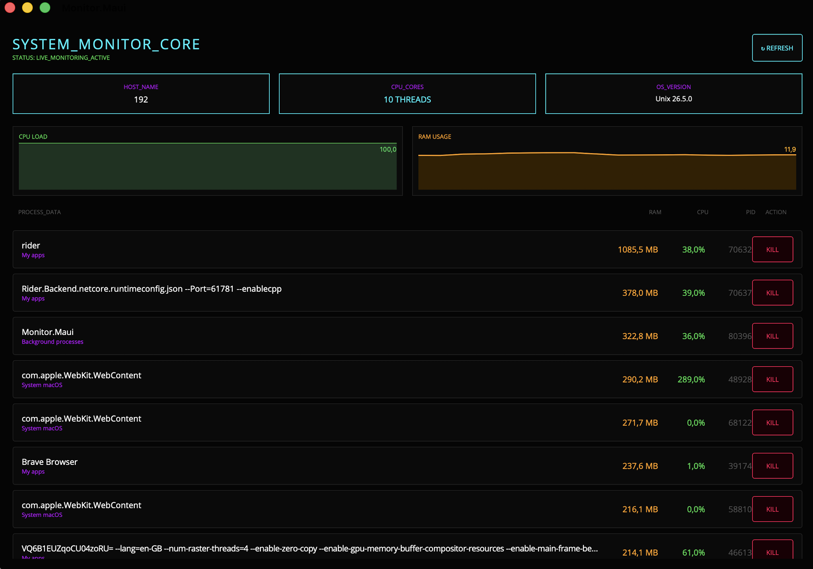

# ⚡ Monitor
> A lightweight, cross-platform system monitor built with .NET MAUI — because Activity Monitor deserved a glow-up.

[](https://github.com/d4nilx/Monitor)
[](https://dotnet.microsoft.com)

---

## 📌 About

**Monitor** is a clean, minimal system monitor for macOS and Windows. It shows you what's eating your RAM, lets you kill rogue processes with one click, and displays live CPU and memory charts — all in a dark UI that doesn't look like it was designed in 2003.

Built as a learning project to explore .NET MAUI, MVVM architecture, and cross-platform development with C#.

### 🌟 Features

- ⚡ **Live process list** — sorted by RAM usage, updates every 3 seconds
- 💀 **Kill any process** — one click, no confirmation dialogs
- 📊 **Real-time charts** — CPU load and RAM usage history
- 🖥️ **System info** — hostname, CPU core count, OS version at a glance
- 🎨 **Dark UI** — minimal, readable, actually pleasant to look at
- 🪟 **Cross-platform** — macOS and Windows from a single codebase

---

## 📸 Screenshots



---

## 🛠️ Tech Stack

| Layer | Technology |
|---|---|
| UI Framework | .NET MAUI 10 |
| Language | C# 13 |
| Architecture | MVVM + CommunityToolkit.Mvvm |
| Charts | MAUI GraphicsView (IDrawable) |
| Process API | System.Diagnostics |
| IDE | JetBrains Rider |

---

## 🚀 Quick Start

### Requirements

- [.NET 10 SDK](https://dotnet.microsoft.com/download/dotnet/10.0)
- macOS 15+ **or** Windows 10 (19041+)
- Xcode 16+ (macOS only)

### Run on macOS

```bash
git clone [https://github.com/d4nilx/Monitor.git](https://github.com/d4nilx/Monitor.git)
cd Monitor
dotnet run --project Monitor.Maui -f net10.0-maccatalyst
```

### Run on Windows

```bash
git clone https://github.com/d4nilx/Monitor.git
cd Monitor
dotnet run --project Monitor.Maui -f net10.0-windows10.0.19041.0
```

---

## 🏗️ Project Structure

```
Monitor.sln
├── Monitor.Core/           # Pure C# logic — models, interfaces
│   ├── Models/
│   │   └── ProcessInfo.cs
│   └── Interface/
│       └── IProcessService.cs
│
└── Monitor.Maui/           # UI layer — MVVM + platform code
    ├── Platforms/
    │   ├── MacCatalyst/
    │   │   └── MacProcessService.cs
    │   └── Windows/
    │       └── WinProcessService.cs
    ├── ViewModel/
    │   └── ProcessListViewModel.cs
    ├── MainPage.xaml
    └── LineChartDrawable.cs
```

---

## 🗺️ Roadmap

- [x] Live process list with Kill button
- [x] CPU and RAM charts
- [x] macOS (Mac Catalyst) support
- [x] Windows support
- [ ] iPhone sync via Firebase
- [ ] Push notifications (RAM threshold alerts)
- [ ] App Store release

---

## 📄 License

Distributed under the MIT License. See [`LICENSE`](LICENSE) for details.

---

## ✉️ Contact

**Daniil Zdanov** — [@d4nilx](https://github.com/d4nilx)

Project: [github.com/d4nilx/Monitor](https://github.com/d4nilx/Monitor)
